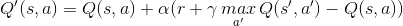
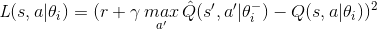
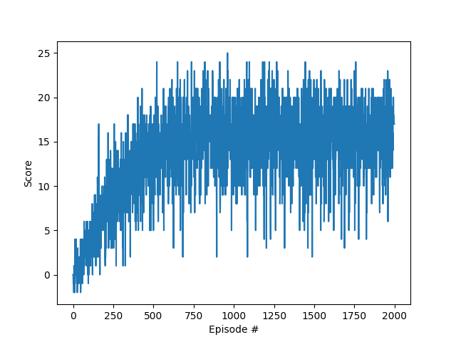

## Deep Q-Network operation

Deep Q-Network (DQN) is a Reinforcement Learning (RL) algorithm that successfully combined the [Q-learning algorithm](https://link.springer.com/article/10.1007/BF00992698) with a neural networks for the first time back in 2013. A single Convolutional Neural Network (CNN) was able to learn from scratch how to play several video games from the Atari 2600 console better than professional human players in most of those games.

In RL, an agent interacts with a given environment trying to learn a policy function (i.e. a function that tells the agent how to act) to maximize the sum of some kind of cumulative reward. The agent learns across a set of subsequent episodes comprising a finite number of time-steps. At a given time-step t, he observes a state st , takes an action at, obtains a reward rt from the environment, and transitions to the next state st+1.

The agent tries to learn the optimal Q-value function that tell him the quality of each possible action for a given state. In each iteration of the algorithm, these Q-values are updated following this rule:

 
    

Additionally, a CNN is used to approximate the Q-value function. Those weights are updated iteratively during the training process. In every of those iterations, the goal is to minimize the loss function below:

 
    

In each timestep, experience tuples (st, at, rt, st+1, bool_episode_done) are fed to the neural network to output the Q-values for every state-action pair. 

At the beginning, the actions are taken randomly. But the more the agent explores the environment and the predictions from the neural network become more reliable, the more he uses those predictions to take actions (thanks to an epsilon-greedy strategy).

Additional measures to enable and speed up convergence of the algorithm are adopted, such as the use of an experience replay database, the target network with frozen weights, and reward clipping. But they are not discussed here.

## Chosen hyperparameters

    BUFFER_SIZE = int(1e5)  # replay buffer size
    BATCH_SIZE = 64         # minibatch size
    GAMMA = 0.99            # discount factor
    TAU = 1e-3              # for soft update of target parameters
    LR = 5e-4               # learning rate 
    UPDATE_EVERY = 4        # how often to update the network

## Neural network architecture

Since non-visual vectorized representation of the states is considered for this environment, a feedforward neural network is chosen (instead of a CNN). This neural net comprises two hidden layers plus the final layer. The hidden layers are made of 64 units each. The final layer outputs a predicted Q-value for each of the possible 4 actions. The non-linear activation function selected is ReLU. No dropout layers were added to prevent overfitting.

As for the optimizer, Adam was chosen to do the job.

## Training results

The following plot shows the evolution of the average reward (over 100 episodes) during training over 2,000 episodes. As it can be seen, the agent steadily learns how to maximize the average reward. In particular, it reaches the goal of +13 around episode no. 500:

## Future Work

It should be noted, however, that when executing run_agent.py, the agent still acts pretty roughly. A new environment based on a visual representation of the states (i.e. pixels) could be compiled in order to use CNNs and achieve a higher average reward. In addition, DQN later extensions such as [double deep Q-learning](https://www.aaai.org/ocs/index.php/AAAI/AAAI16/paper/download/12389/11847), a [dueling network architecture](https://arxiv.org/pdf/1511.06581.pdf), and a [prioritized experience replay](https://arxiv.org/pdf/1511.05952.pdf) could be considered to speed up convergence of the algorithm.
